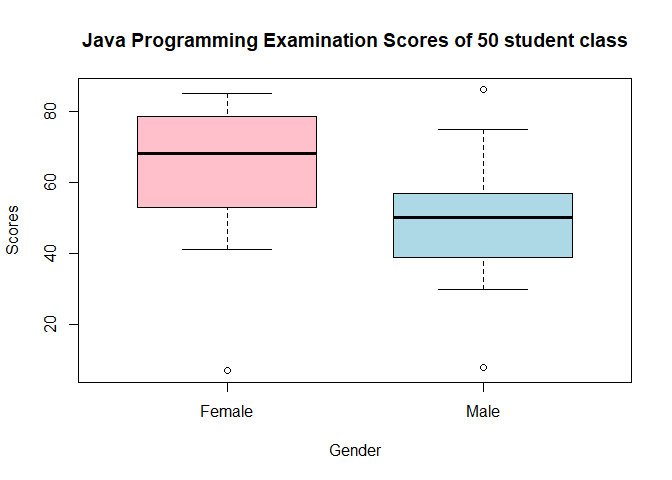

RODILLAS, CHRISTIAN MIGUEL T. FA 1
================
2024-02-01

``` r
#1. find the skewness
Results <- read.csv("E:/Downloads/Results.csv") #please adjust depending on the file name and location
View(Results)


#get all the means 
arch1_mean <- mean(Results$arch1, na.rm = TRUE)
prog1_mean <- mean(Results$prog1, na.rm = TRUE)
arch2_mean <- mean(Results$arch2, na.rm = TRUE)
prog2_mean <- mean(Results$prog2, na.rm = TRUE)

#get all the median
arch1_median <- median(Results$arch1, na.rm = TRUE)
prog1_median <- median(Results$prog1, na.rm = TRUE)
arch2_median <- median(Results$arch2, na.rm = TRUE)
prog2_median <- median(Results$prog2, na.rm = TRUE)

#get all the standard deviation
arch1_sd <- sd(Results$arch1, na.rm = TRUE)
prog1_sd <- sd(Results$prog1, na.rm = TRUE)
arch2_sd <- sd(Results$arch2, na.rm = TRUE)
prog2_sd <- sd(Results$prog2, na.rm = TRUE)

#get all their skewness using the formula 

arch1_skew <- (3*(arch1_mean - arch1_median))/arch1_sd
print(paste0("The value of skewness for prog2 is ", arch1_skew))
```

    ## [1] "The value of skewness for prog2 is -0.606904206669057"

``` r
prog1_skew <- (3*(prog1_mean - prog1_median))/prog1_sd
print(paste0("The value of skewness for prog1 is ", prog1_skew))
```

    ## [1] "The value of skewness for prog1 is -0.643228962747166"

``` r
arch2_skew <- (3*(arch2_mean - arch2_median))/arch2_sd
print(paste0("The value of skewness for arch2 is ", arch2_skew))
```

    ## [1] "The value of skewness for arch2 is 0.542128564908418"

``` r
prog2_skew <- (3*(prog2_mean - prog2_median))/prog2_sd
print(paste0("The value of skewness for prog2 is ", prog2_skew))
```

    ## [1] "The value of skewness for prog2 is -0.356290812560432"

``` r
#as an alternative, this is when using packages

library(moments)
print("Next, this is using library package")
```

    ## [1] "Next, this is using library package"

``` r
arch1_skewpack <- skewness(Results$arch1, na.rm = TRUE)
print(paste0("Using the package, the value of skewness for arch1 is ", arch1_skewpack))
```

    ## [1] "Using the package, the value of skewness for arch1 is -0.512946249306507"

``` r
prog1_skewpack <- skewness(Results$prog1, na.rm = TRUE)
(paste0("Using the package, the value of skewness for prog1 is ", prog1_skewpack))
```

    ## [1] "Using the package, the value of skewness for prog1 is -0.333426526864521"

``` r
arch2_skewpack <- skewness(Results$arch2, na.rm = TRUE)
(paste0("Using the package, the value of skewness for arch2 is ", arch2_skewpack))
```

    ## [1] "Using the package, the value of skewness for arch2 is 0.448160046465879"

``` r
prog2_skewpack <- skewness(Results$prog2, na.rm = TRUE)
(paste0("Using the package, the value of skewness for prog2 is ", prog2_skewpack))
```

    ## [1] "Using the package, the value of skewness for prog2 is -0.301826930004153"

1.  answer: The two programs above shows 2 different ways to provide a
    skewness through the use of R. one is through packages and another
    is through formula given. This comparison shows the discrepancy of
    skewness values using formula and using packages. It is much more
    efficient to use the packages available in Rstudio since it provides
    a more accurate interpretation of data, while being less time
    consuming. On the case of its approximation, the R provides an
    acceptable range of skewness values that showcases the distribution
    of the scores of the students. With negative values indicating that
    it is left-skewed distribution, which in this case, shows that more
    students in arch1, prog1, and prog2 have more people with higher
    grades. Vice versa, arch2 shows that it has a right-skewed
    distribution, meaning more students are on the lower side. Skewness
    is a reasonable data to show various tendencies of a data, in this
    case, in the marks of the class.

``` r
#2.  For the class of 50 students

#(a)
#creating a vector for each gender and displaying stem and leaf plot

class_females <- c(7, 59, 78, 79, 60, 65, 68, 71, 75, 48, 51, 55, 56, 41, 43, 44, 75, 78, 80, 81, 83, 83, 85)
class_males <- c(8, 49, 49, 30, 30, 31, 32, 35, 37, 41, 86, 42, 51, 53, 56,42, 44, 50, 51, 65, 67, 51, 56, 58, 64, 64, 75)

stem(class_females)
```

    ## 
    ##   The decimal point is 1 digit(s) to the right of the |
    ## 
    ##   0 | 7
    ##   2 | 
    ##   4 | 13481569
    ##   6 | 058155889
    ##   8 | 01335

``` r
stem(class_males)
```

    ## 
    ##   The decimal point is 1 digit(s) to the right of the |
    ## 
    ##   0 | 8
    ##   1 | 
    ##   2 | 
    ##   3 | 001257
    ##   4 | 122499
    ##   5 | 01113668
    ##   6 | 4457
    ##   7 | 5
    ##   8 | 6

answer:leaf and stem plots provide an alternative way to visualize data
distribution, specially numerical, and have some advantagesfor it.
First, it shows with ease of representation due to its minimalist nature
and simplicity. It also provides a graphical data in an ordered manner
while retaining its original data, and in return, shows major digits of
the value, making it easier to identify patterns and trend

``` r
#(b) boxplot and discuss the findings

class_females <- c(7, 59, 78, 79, 60, 65, 68, 71, 75, 48, 51, 55, 56, 41, 43, 44, 75, 78, 80, 81, 83, 83, 85)
class_males <- c(8, 49, 49, 30, 30, 31, 32, 35, 37, 41, 86, 42, 51, 53, 56,42, 44, 50, 51, 65, 67, 51, 56, 58, 64, 64, 75)
data_list <- list(Female = class_females, Male = class_males)
boxplot(data_list, main = "Java Programming Examination Scores of 50 student class", col = c("pink", "lightblue"), xlab="Gender", ylab="Scores", border="black", boxwex = 0.7)
```

<!-- -->
